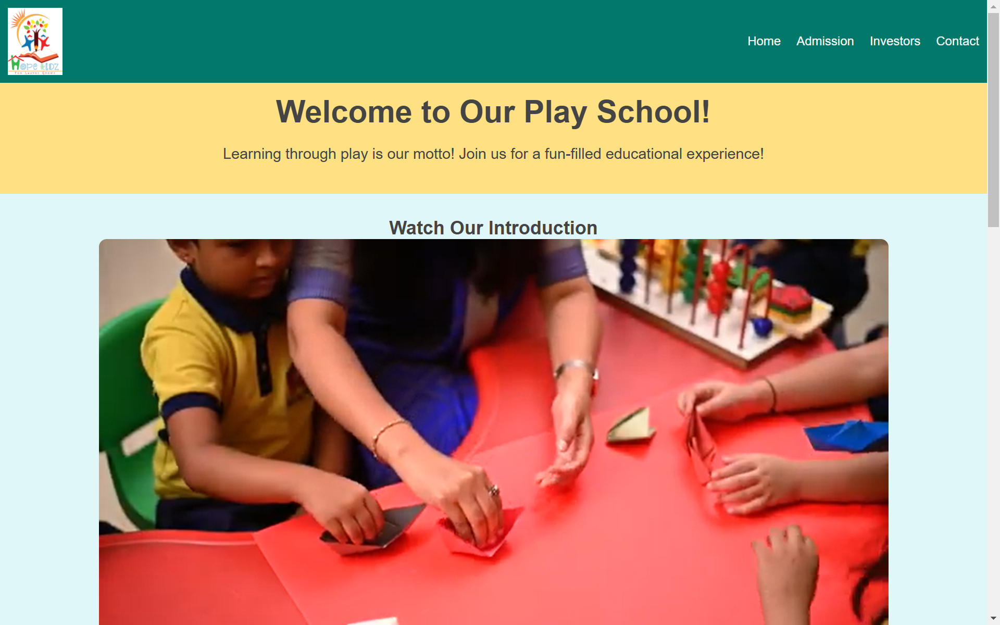

# **Web Programming Projects Repository**

Welcome to the **Web Programming Projects Repository (IPS)**! This repository contains various projects developed as part of my web programming class. Each project is organized into a separate folder with its own `index.html` and supporting files.

---

## **Repository Structure**

The repository is structured as follows:

```
/project-folder-name
  index.html
  style.css
  script.js
```

- Each folder represents a standalone project.
- Projects are named based on their topic or functionality.

---

## **Projects**
### **1. Portfolio Website**
- **Date:** 14 December 2024  
- **Description:**  
  A modern portfolio website showcasing my skills, projects, and contact information. Built with responsive design principles for an optimal experience across all devices.  

    

---

### **2. Marketplace**
- **Date:** 16 December 2024  
- **Description:**  
  A fully responsive marketplace website where users can browse products, view details, and add items to their cart. Implements interactive features using JavaScript.  

    


---
### **3. Car Website**
- **Date:** 4 January 2025  
- **Description:**  
  A visually appealing and interactive website for car enthusiasts or dealerships, featuring:  
  An extensive catalog of cars with images, prices, and specifications.

<div style="display: flex; justify-content: space-between;">
  
  
</div>


---
### **4. Play School**
- **Date:** 6 January 2025  
- **Description:**  
  A delightful and engaging website designed for a play school to attract and inform parents,

<div style="display: flex; justify-content: space-between;">
  
  
</div>


---


## **How to Use**

1. Clone the repository:
   ```bash
   git clone https://github.com/shkshreyas/webips.git
   ```
2. Navigate to a project folder:
   ```bash
   cd <project-name>
   ```
3. Open `index.html` in your browser to view the project.


## **Contributing**

This repository is for class projects only. If you'd like to suggest improvements or report issues, feel free to open an issue or submit a pull request.

---

## **Contact**

Feel free to reach out to me for any questions or collaboration opportunities:

- **Name:** Shreyas Kumar
- **GitHub:** [shkshreyas](https://github.com/shkshreyas)
- **LinkedIn:** [shkshreyas](https://www.linkedin.com/in/shkshreyas)
